# Covid-19 classification using Chest X-Ray Dataset
This repository contains code and results for COVID-19 classification assignment by Deep Learning Spring 2020 course offered at Information Technology University, Lahore, Pakistan. This assignment is only for learning purposes and is not intended to be used for clinical purposes.

## Dataset
Dataset is available [here](https://drive.google.com/file/d/1-HQQciKYfwAO3oH7ci6zhg45DduvkpnK/view).
This dataset contains chest X-Ray images classified into *infected* and *normal* categories.

## Description
Classification was done with transfer learning using the [VGG-16](https://arxiv.org/abs/1409.1556) and [ResNet-18](https://arxiv.org/abs/1512.03385) architectures and PyTorch.
Experiments were done using two approaches:
1. **Using pre-trained feature extraction layers:** Convolution layers pre-trained on ImageNet
   were used to extract features and custom dense layers were added at the end of the network and trained.
2. **Fine-tuning:** Models trained on ImageNet were finetuned. Three different configurations
   were used in this approach. 
   1. In the first configuration, only one convolution layer
   including the dense layers were trained.
   2. A few more convolution layers were trained.
   3. The entire network was finetuned. Note that the results section contains the results of
      this configuration only.

## Experimental Setup
Both the models were modified to include only two final dense layers containing 120 and
2 units respectively.

Additionally, in all the experiments the models were trained for six epochs with *Adam*
optimizer (learning rate: 0.001, beta1: 0.9, beta2: 0.999, epsilon: 1e-8)

## Training Statistics
Loss and accuracy curves during training for all the experiments are presented below
#### VGG-16
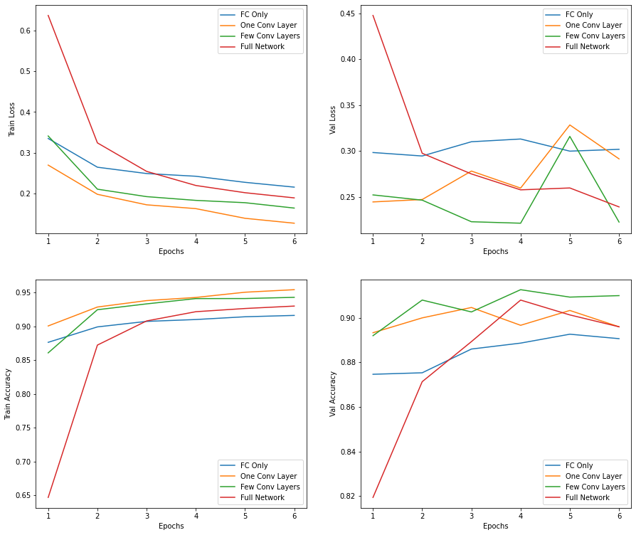

Layers Trained | Train Accuracy | Train Loss | Validation Acuracy | Validation Loss
-----------|---------|---------|----------|----------
Dense layers | 0.916|0.216|0.891|0.302
One Convolution layer + Dense layers | 0.954 | 0.128 | 0.896 | 0.292
Three Convolution layers + Dense layers | 0.943 | 0.165 | 0.910 | 0.223
Entire Network | 0.930 | 0.190 | 0.896 | 0.239
#### ResNet
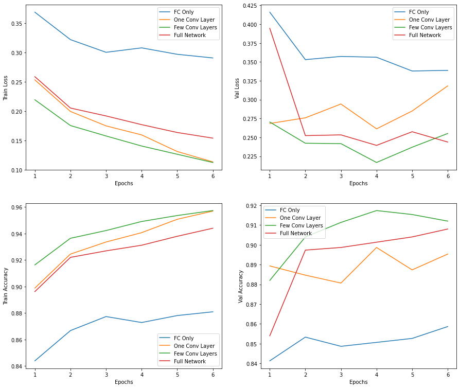

Layers Trained | Train Accuracy | Train Loss | Validation Acuracy | Validation Loss
-----------|---------|---------|----------|----------
Dense layers | 0.881|0.291|0.859|0.339
One Convolution block + Dense layers | 0.957 | 0.114 | 0.895 | 0.318
Two Convolution blocks + Dense layers | 0.957 | 0.113 | 0.912 | 0.255
Entire Network | 0.944 | 0.154 | 0.908 | 0.244
## Results

### VGG-16

#### Pre-trained Feature extraction

Accuracy | F1-score
---------|---------
0.953 | 0.961

##### Confusion Matrices
- Train

  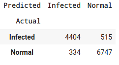

- Validation

  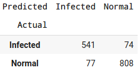
  
- Test

  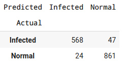
    
 
#### Fine-tuning

Accuracy | F1-score
---------|---------
0.973 | 0.978

##### Confusion Matrices
- Train

  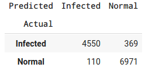

- Validation

  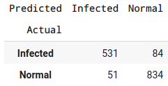
  
- Test

  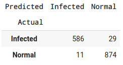

### ResNet-18

#### Pre-trained Feature extraction

Accuracy | F1-score
---------|---------
0.925 | 0.938

##### Confusion Matrices
- Train

  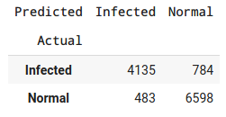

- Validation

  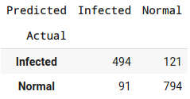
  
- Test

  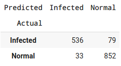

#### Fine-tuning

Accuracy | F1-score
---------|---------
0.968 | 0.973

##### Confusion Matrices
- Train

  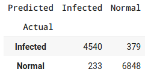

- Validation

  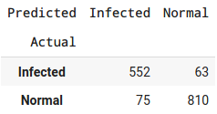
  
- Test

  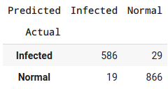
  
## Analysis
Higher accuracies were acheived when the entire network was finetuned. This can be due to the
fact that the original ImageNet dataset is different from the current task involving medical
images. Fine-tuning of the convolution layers adjusted the features extracted from the network
and showed better results.
